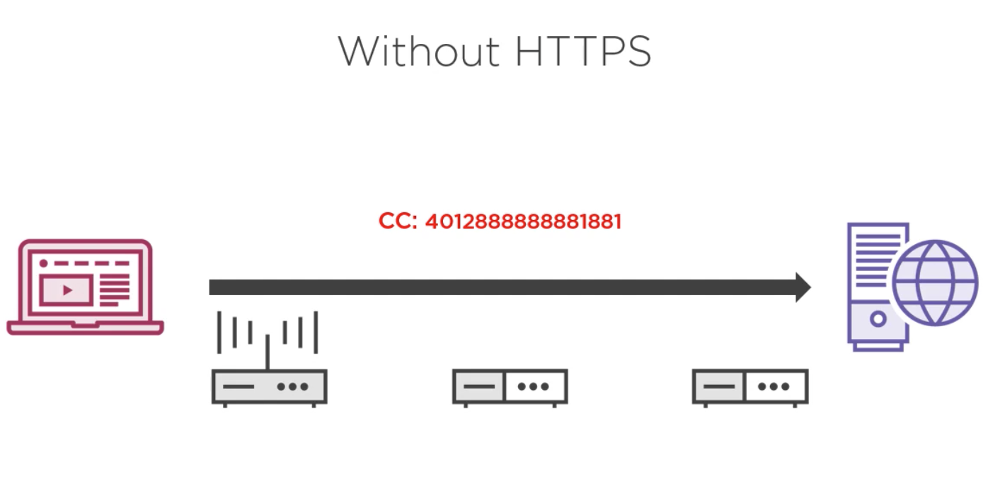
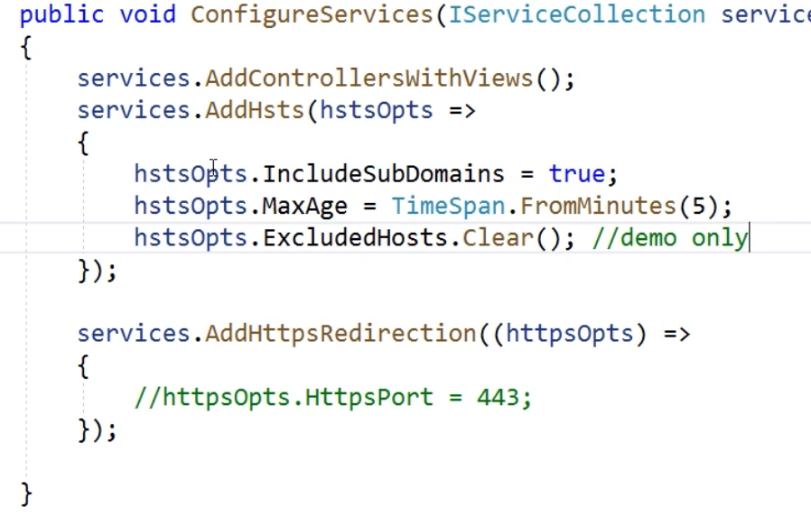

# HTTPS  

<!-- TOC -->

- [HTTPS](#https)
    - [What is HTTPS?](#what-is-https)
    - [How HTTPS Works ?](#how-https-works-)
    - [How Client Trust the Server Certificate?](#how-client-trust-the-server-certificate)
    - [Running an HTTPS application from Visual Studio](#running-an-https-application-from-visual-studio)
    - [Requiring vs Enabling HTTPS in ASP.NET](#requiring-vs-enabling-https-in-aspnet)
        - [HSTS (HTTP Strict Transport Security)](#hsts-http-strict-transport-security)
        - [Preloading](#preloading)
    - [References](#references)

<!-- /TOC -->


## What is HTTPS? 

 .  

SSL = Secured Socket Layer   
TLS = Transport Layer Security  

TSL is a successor for SSL and is advised to use. So TLS / SSL is the actual protocol that provides the encryption and security over HTTP.  

 . 

That means a middle can read information moving between client and server.  But when we use HTTPS, the information gets encrypted. 

  

## How HTTPS Works ?  


It all starts with a handshake.  

1. A client initiates the communication with server by typing a URL(www.google.com) in a browser. Here client is the browser and server is Google. 

2. Handshake is the process in which Client and Server negotiates  

        * Protocol they are going to user over HTTP. (TLS/SSL)  
        * Version of the protocol. (TLS3.0).  
        * Cipher suite they will use for encryption.  
3.  Once handshake is completed, the server will send its public key to  
    the client. So client will use server's public key for encrypting 
    informations its sending to server. Only the server can decrypt this information using its private key. (Asymetric encryption) 

4. Next the two sides uses a Shared key for further encryption, so they can 
   only decrypt. (Symmetric encryption) . 


## How Client Trust the Server Certificate?  

In otherwords, how the client knows that its talking to correct server ? The answer is the server certificate.  

Every certificate has an issuer and a subject. subject is the company (Google, Microsoft, HP, Your Company etc.) and issuer is usually a high level certificate providers (Verisign, Digicert) etc.   

Client machines already have public key certificates of these  Certificate providers/issuers installed along with the Operting System.     


Server will have to purchase a certificate from the Certificat authority/providers. This certificate 
has main information like subject :Company and Issuer : Certificate authority. 

So during handshake, when server sends its certificate, Client can verify its genuity using one of the issuer public certificate installed in it and can trust that certificate .  


**In Summary, for HTTPS to work two things should happen.  
 1. Server should have a valid certificate from a certificate authority.
 2. Client should trust the server certificate. ** 

## Running an HTTPS application from Visual Studio  
So now question arises is , when you are in development mode how the https works ? Or in another way where does we get the server certificate and how we are trusting ?  

When we run a web application with https enabled and run, you will get the following error.  


Or  (When using IIS Express)

  

When you accept this certificate, it will be .  


What does this mean ?  Let us dissect based on our previous understand. Here we are running a 
secure web application and for successfully running this application locally we need two things to happen .  

1. The server needs a certificate. 
2. That certificate should be a trusted certificate in Client.  

In case of Windows PC and if you are running your web application from IIS express, IIS will provide 
a certificate named localhost , which you have to trust as root certificate for browser to render 
the html from that server.  


Now you can see this certificate in your trusted certificates.  

  

But in case of mac, we need to install the certificate using following commands.  

```bash  
~ $ dotnet dev-certs https --trust 
```

This will show up in keychain as shown below.  

 

Note : If its showing as 'Not trusted' , double click -> trust and when using -> Always trust.  

## Requiring vs Enabling HTTPS in ASP.NET  

By default, when you create an ASP.NET Core web application your application is enabled with HTTPS. As you can see below, we can see two URL's.  


Also HTTPS Redirection is set as a middle ware. What this middle ware does ? It redirects all traffic 
coming in local http to https as shown below. 


You can configure your port and status code at runtime if you want based on your environment.  


This image shows whats happening underhood.  

  

Now what we have done above is redirecting all communication to our site through HTTPS.  But the draw back there is atleast once the Client is comming to our non secure endpoint and lot of redirections. We can avoid this using "HSTS" : HTTP Strict Transport Security.  

### HSTS (HTTP Strict Transport Security) 
HSTS is a way of telling the client browser to use only HTTPS for further communication with this site. 

In case of HSTS, during the first non secure visit to our site, we will send a HSTS header to the
Client browser that any future communication to this site should use only HTTPS for this much duration
of time.  

 . 

So any further communication to this site after client received the HSTS response will go directly 
to the HTTPS endpoint.  This will avoid redirections after the first visit.  

 . 

Following are settings as part of HSTS response header . 

     

In an ASP.NET Core Application, you can enable and configure as follows.  

 



If you check your developer tools, you can see the HSTS header with your configuration. 

 . 

### Preloading  

So far, we are sending HSTS to browser after first visit to site. But there is an option to register
your domain in 'https://hstspreload.org" .  Browsers maintains this hstspreload and if your site is
in this list, then by default browser will use https for visiting your site. This is called as Preloading.   

  

  

## References  

[What every developer should know about HTTPS ?](https://app.pluralsight.com/library/courses/https-every-developer-must-know/table-of-contents)